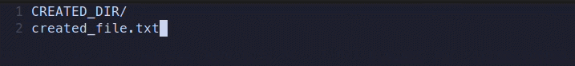
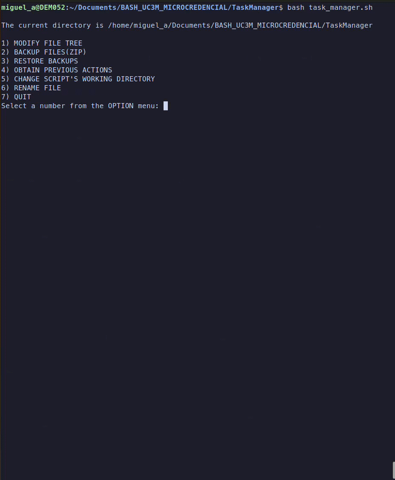
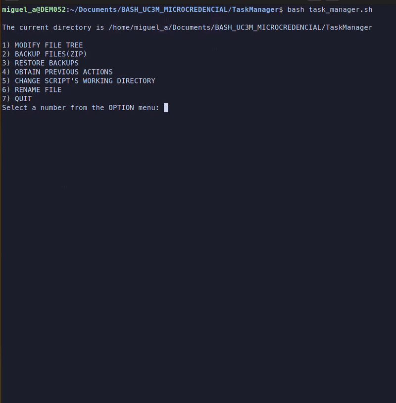
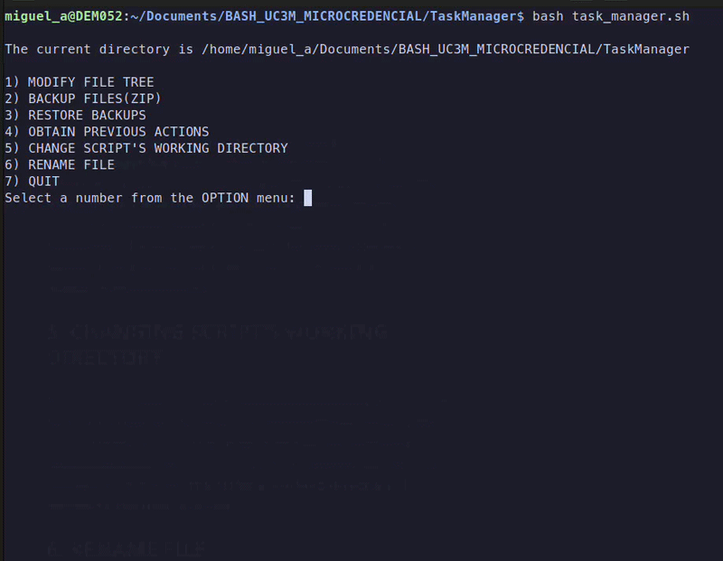
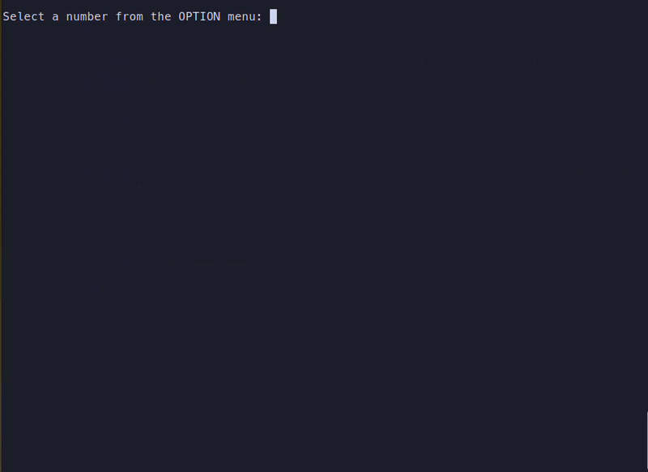

This is a script that was developed as a final project for Microcredencial Universitaria Programación de la Shell de Linux, a course
offered at the Universidad Carlos III de Madrid.

# Explanation

When executing this script, the user will be presented with a 5 option menu.

## 1. MODIFY FILE TREE
    
When the user inputs a 1 in the menu, a text editor will be displayed with the current files and directories of the PWD.
By default, the script attempts to open the vi text editor and, if it fails, the nano editor. If neither of them are found, then
an error is shown and the user is returned to the option menu.
   
Within the text editor, the user can modify the current files and directories by directly typing in the editor. 
### Creating and deleting files

**To create a file**, the user must write the desired filename in a new line of the editor and then save the changes.
The script detects that a new name was added and creates a new file for it.

**To delete a file**, the user must delete the entire name of the filename. The script detects that there is a missing filename and it deletes it from the directory.
**CAREFUL**, if a folder/filename is changed it will also be considered as a new file/directory so the original one will be deleted and replaced by the new name. All the 
contents will be lost.

### Creating and deleting directories

The MODIFY FILE TREE also allows to create and delete directories in a very similar way to files.

**To create a directory**, the user must write the desired name for the directory and end such name with a /. **IF IT DOES NOT END WITH A /, IT WILL BE CONSIDERED A FILE**.

**To delete a directory**, it is done exactly in the same way as files, that is, deleting the entire name of the directory.

**Example creating a file and a directory**

**Example deleting a file and a directory**

## 2. BACKUP FILES(ZIP)

This option opens a text editor where the user can **specify the files they wish to be compressed**.
The user can keep the opened editor as it is to compress  all the files of the current working directory.
Alternatively, if any filename is deleted from the opened editor, it will not be considered for the compression.
The first editor considered is vi, if not, nano is used. If neither of them are available, an error message will be displayed.

The generated ZIP file will be found within the original directory where the script was executed from. **The ZIP file is called backup{number}.zip**
This way, subsequent backups will not be overwritten by previous ones.

**Example of backing up file{1..7}.txt and showing that the backup correctly stores the data**

## 3.RESTORE BACKUPS

This option takes the backup{n}.zip files that were created by the backup files(ZIP) action(num 2) and unpacks them into the RESTORED_CONTENT folder.
This recovery process is done while ensuring that **the possible file conflicts are resolved**. If several zips include the same filename, **only the one
with the most recent modification date is considered**. This way, it is ensured that only the newest version is retrieved. **All the backup{n}.zip files that
were successfully used, are moved into the USED folder**. By checking this folder, the user can verify which backup files were applied.

**Considering backup0 created in the previous section and a later backup with the same filenames but that is more recent.**

**Restoring two backups which contain the same files but with different dates. Only the newest copies are retrieved(found in RESTORED_CONTENT/) and the applied backups are stored within USED/**

## 4.OBTAIN PREVIOUS ACTIONS

During the execution of the shell, a file called **task_manager.log** is generated and written upon. This file stores all the actions performed with the script.
This way the user can track which files and directories were deleted or created and when. Apart from being able to access this file manually(by for example using cat),
the script provides an option to display the last n messages from said log file without exiting the script.

## 5. CHANGING SCRIPT'S WORKING DIRECTORY

This option allows to move between directories of your device so that you can add and remove files/directories in any path. In this option, a menu is displayed
with all the accessible directories from the current path. Then, after by specifying a number from the list, **the script's working directory is moved to the new location**.

**Example of changing the script's working directory to PRUEBA/**

## 6. RENAME FILE

This option allows the user to **rename a file of the script's current working directory without modifying the file's extension**. The user is presented with  all the files of the directory.
Then, they are asked to introduce the exact name of the file (including the extension) they wish to rename. Afterwards, they are prompted for a new name. The file will be renamed
with the specified string while keeping the original extension at the end.**To abort the renaming, -1 must be specified within the filename selection prompt**.

**Example, renaming a file from original_name.invented_extension to new_name.invented_extension**

## 7. QUIT

This option is used **to terminate the execution of the script**. When the number 5 is inputted within the options menu, the script finishes.

